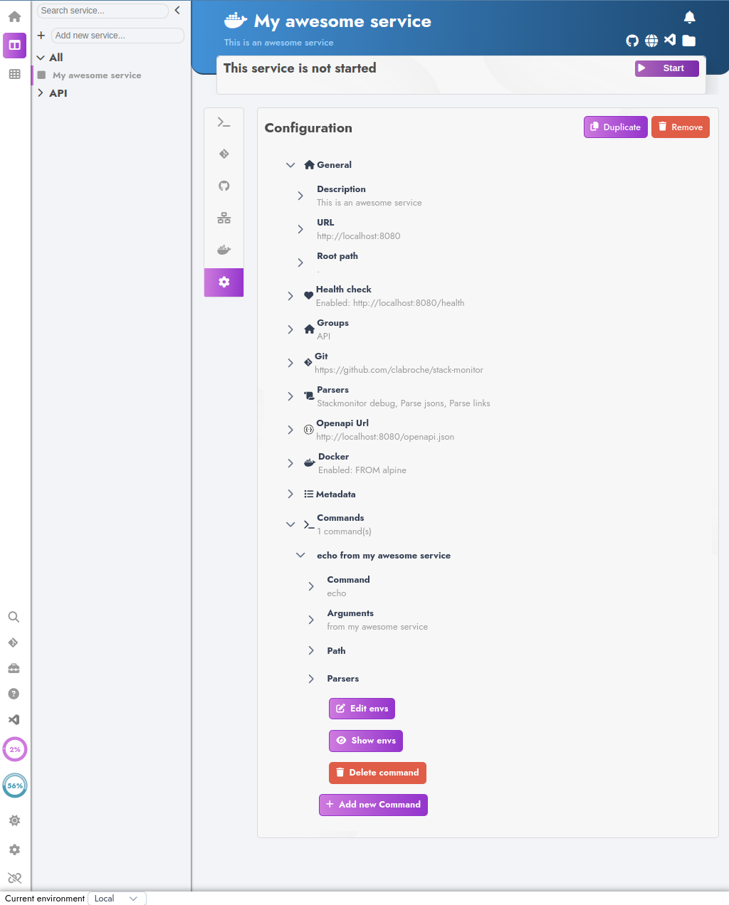

# Getting Started

## Installation

### Prerequisites

- [Node.js](https://nodejs.org/) version 16 or higher.
- Terminal for launching Stack Monitor (CLI).
- Git to enable git capabilities.

To install in a git project:
::: code-group
```sh [npm]
$ npm install -D @iryu54/stack-monitor
```

```sh [pnpm]
$ pnpm add -D @iryu54/stack-monitor
```

```sh [yarn]
$ yarn add -D @iryu54/stack-monitor
```
:::

To install in global:
::: code-group

```sh [npm]
$ npm install -g @iryu54/stack-monitor
```

```sh [yarn]
$ yarn global add @iryu54/stack-monitor
```
:::


### Launch

In project installation, you can launch it by adding a script to your package.json:

```json [json]
{
  "name": "...",
  "version": "...",
  "description": "...",
  "main": "src/stack.js",
  "license": "...",
  "author": "...",
  "scripts": {
    "serve": "cross-env STACK_MONITOR_HTTP_PORT=6872 stack-monitor ./src/stack.js"
  }
}
```
Stack Monitor ships with a command line. After global installation, start it by running:

```sh [bash]
$ stack-monitor <config-directory>
```

It will launch a web interface to write and monitor all your services

